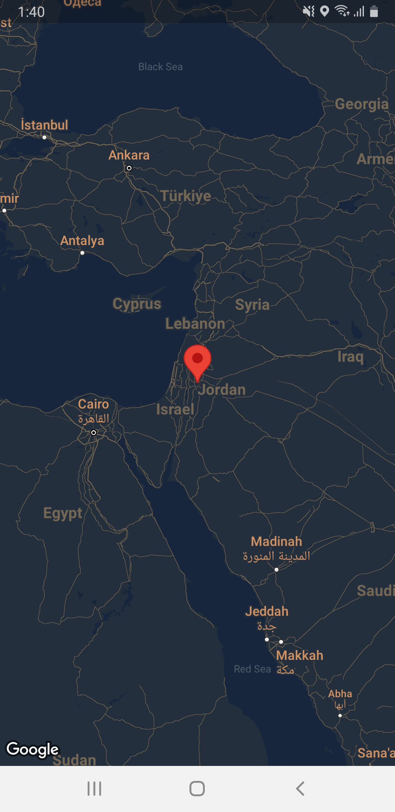

# google_maps

** Resources::-

https://stylist.atlist.com/

https://pub.dev/packages/google_maps_flutter

https://pub.dev/packages/location

## Topics Included

- **Markers:** Used to mark specific points on the map, such as landmarks or destinations.

- **Polylines:** Draw lines on the map to represent routes or boundaries.

- **Polygons:** Draw filled shapes on the map to represent areas like parks or neighborhoods.

- **Circles:** Draw circular overlays on the map to represent areas of interest with a specific radius.


## To Generate SHA-1 key, run this command in the terminal:

```bash
./gradlew signingReport
``` 

Note the following line for the zoom attribute in maps (google_maps_flutter package):

&middot; World view: 0 to 3
&middot; Country view: 4 to 6
&middot; City view: 10 to 12
&middot; Street view: 13 to 17
&middot; Building view: 18 to 20



